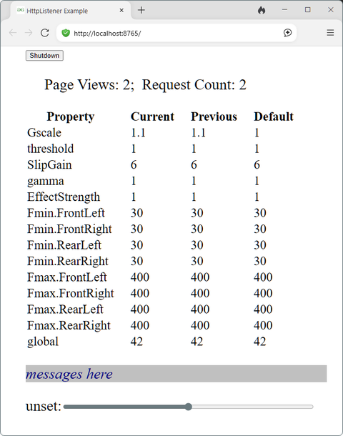
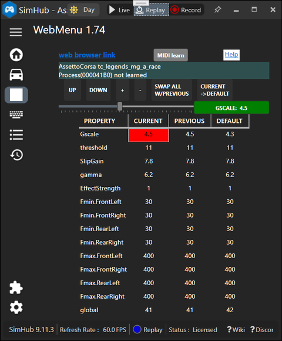

## [OpenKneeboard](https://openkneeboard.com/)-[SimHub](https://www.simhubdash.com)-[plugin-menu](https://github.com/blekenbleu/OpenKneeboard-SimHub-plugin-menu/wiki)
*[SimHub plugin properties](https://github.com/blekenbleu/JSONio) HTTP table for e.g.
[OpenKneeboard](https://github.com/OpenKneeboard/OpenKneeboard)*  
  
WPF plugin user interface employs 7 buttons and one slider:  
  

### background
Currently, access from SteamVR to SimHub (and its plugin menus) is by e.g.
- [SteamVR's Desktop](https://store.steampowered.com/news/app/250820/view/2898585530113863169)
- [Desktop+](https://steamcommunity.com/app/1494460)

SimHub dash overlays lack VR support, but [OpenKneeboard can display SimHub
overlays](https://www.madmikeplays.com/free-downloads#block-yui_3_17_2_1_1742822224076_6340) via HTTP.

### wanted
An always visible dedicated menu display  
for tweaking e.g. harness tensioner or haptics settings (properties).  
- instead of invoking a computationally expensive overlay GUI,
	- manipulate properties in an HTML table
	- navigate and change table values by e.g. rotary encoders, sliders, buttons

HTML table cell updates should have lower processing overhead than graphical overlay..  

### resources
- from [JSONio](https://github.com/blekenbleu/JSONio):
	- in `OpenKneeboard-SimHub-plugin-menu.csproj`:  
	 could not get [ReferencePath](https://learn.microsoft.com/en-us/troubleshoot/developer/visualstudio/project-build/troubleshooting-broken-references)
	 working;&nbsp; copied JSONio `HintPath`s  
	- SimHub confused `OKSHmenu` with `JSONio` plugin until renaming `class JSONio`.  
	`KSHmenu.ChangeProperties` needs its own `ExternalScript.CarChange` event trigger setting  
	in **SimHub Controls and events**.
- [**TcpMultiClient**](https://github.com/blekenbleu/TcpMultiClient) - multiple `keep-alive` TCP connections
	- TcpListener AcceptTcpClientAsync, ConcurrentDictionary, NetworkStream WriteAsync, StreamReader
	- a better starting point and learning exercise than either:
		- [A Simple HTTP SSE server in C#](SSE.md) - proof of concept -
  			[Gist](https://gist.github.com/define-private-public/d05bc52dd0bed1c4699d49e2737e80e7)
			- user-space `HttpListener` server can serve only to browsers on the same PC
		- [**TCPListener - based HttpServer**](https://github.com/blekenbleu/HttpServer) avoided localhost limitation,  
			but potentially problematic SSE `keep-alive`  

## plan
- generate an [HTML `<table>`](HTML.md) from `NCalcScripts/OKSHpm.ini` JSON properties during `Init()`
- hand-code [JavaScript](JavaScript.md) for browser to update `<table>` from Server-Sent Events
- send [HTML](HTML.cs) + [JavaScript](JavaScript.cs) page to client browsers
- send Server-Sent Events for `<table>` cell property values and e.g. scroll actions - **working**
	- *replaced* TCPserver.cs content with [TcpMultiClient](https://github.com/blekenbleu/TcpMultiClient) `Program.cs` Main() + MultiClientTcpServer()
	- *replaced* HTTPserver.cs content with IsHttp() + ClientTask()
- set HTML scroll and (*to do*) slider with car change; do not wait for WPF menu open
- *to do*: [MIDI input support](https://github.com/blekenbleu/MIDIio/blob/UI/docs/map.md) for `<table>` changes

### new-to-me tricks  
- handle all button events in one method by [`(e.OriginalSource as FrameworkElement).Name`](https://stackoverflow.com/a/26938950)
- [NAudio `MidiIn.NumberOfDevices`, `MidiIn(deviceNumber)`](https://github.com/naudio/NAudio/blob/master/NAudioDemo/MidiInDemo/MidiInPanel.cs#L24)
	- [`ConcurrentDictionary<>`](https://www.dotnetperls.com/concurrentdictionary)  
	- [System.Threading.Channels](https://github.com/blekenbleu/MIDIio/blob/UI/docs/map.md#queue-multiple-midi-device-inputs-by-systemthreadingchannels)
- [`TcpListener` Web Server](TcpListener.md)

#### [SimHub plugins](https://github.com/SHWotever/SimHub/wiki/Plugin-and-extensions-SDKs) are .NET Framework 4.8 WPF User Control libraries
- [SimHub plugin build process](https://blekenbleu.github.io/static/SimHub/)  
	- [.NET Framework v4.8](https://dotnet.microsoft.com/en-us/download/dotnet-framework/net48)  
		Windows-only version of .NET for building client and server applications;  
		latest supported version is `4.8.1` (*August 9th, 2022*), but SimHub uses `4.8`  
	- Visual Studio [`new project > WPF User Control Library (.NET Framework)`](https://learn.microsoft.com/en-us/dotnet/desktop/winforms/advanced/walkthrough-creating-new-wpf-content-on-windows-forms-at-design-time) has xaml
